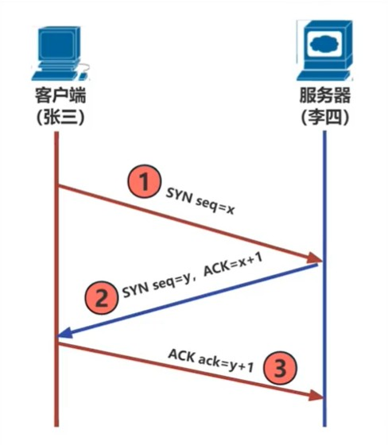

# TCP

## TCP握手为什么是三次

**设计TCP握手的目标**

让通信双方都知道通信双方的收发功能是正常的。

|握手次数|效果|
|---|---|
|第一次握手|张三知道自己能发出信件 李四知道自己能收到信件 李四知道张三能发出信件|
|第二次握手|李四知道自己能发出信件 张三知道自己能收到信件 张三知道李四能发出信件 张三知道李四能收到信件|
|第三次握手|李四知道张三能收到信件|

**结论**

两次达不到，三次刚刚好，四次没必要
