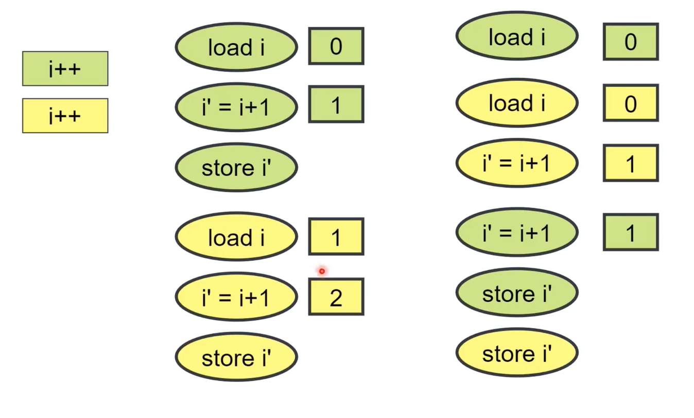
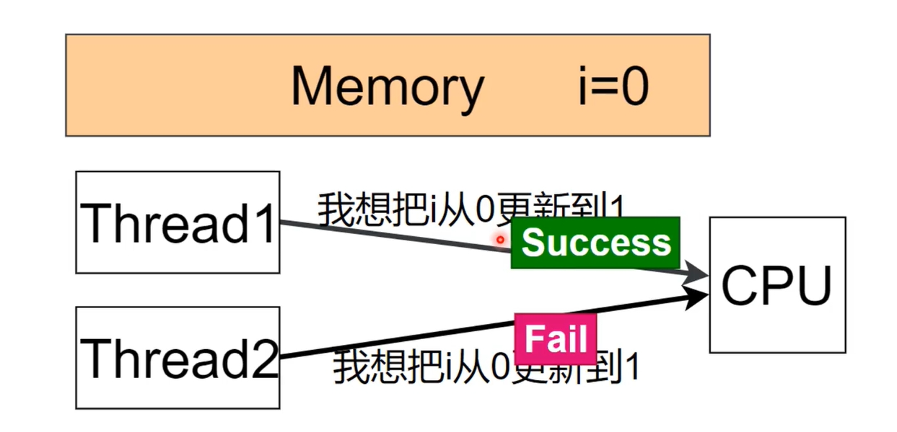

# 生产者消费者模型

通过三个方面回答：组成、工作流程、使用到的技术

## 组成

由 **若干生产者线程** **若干消费者线程** 和 **一个线程安全队列** 组成。

## 工作流程

1. 生产者线程 生产要处理的任务调用线程安全队列的接口，push到队列中
2. 消费者线程 消费要处理的任务，调用线程安全队列的接口， 从队列中获取并pop

3. 在生产消费过程中，
    1. 生产者线程与生产者线程保证互斥的往队列中进行push
    2. 消费者线程与消费者线程保证互斥的从队列中拿任务
    3. 生产者线程与消费者线程既要保证互斥， 也要保证同步

4. 保证互斥的理解：生产的时候， 不能消费；消费的时候， 不能生产
5. 保证同步的理解：生产的完毕，告诉消费； 消费完毕，告诉生产

6. 可以总结为：1个线程安全的队列、2种角色的线程、3种关系

## 使用到的技术

### 同步和互斥技术

1. 互斥锁 + 条件变量

2. 信号量

3. 原子操作

问题：
- `i++;`操作由3个操作组成：`load i;` `i'= i+1;` `save i;`,当多个线程同时执行i++时，实际原子操作和期望不一致。左侧是期望的原子操作，右侧是可能的实际操作。

解决：CPU提供执令
- CAS(&i, oldValue, newValue)：compare and swap，操作前先将变量和oldValen比较，相等才给变量赋newValue
